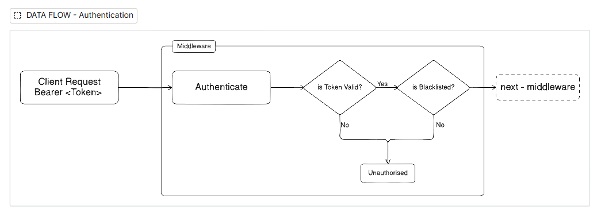
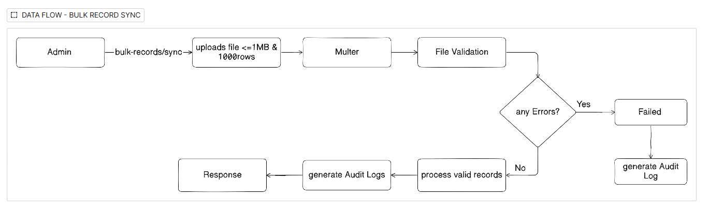
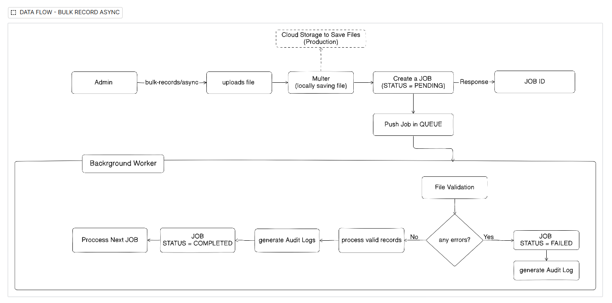

# FinTrack Core Features & System Architecture

This document explains the core technical features of the FinTrack API, following first-principle design patterns for security, scalability, and reliability.

---

## 1. User Creation & Authentication
**The Problem**: Managing identities securely while ensuring mandatory security policies.
- **Workflow**: 
  - Users are created with **UUID v4** identifiers to prevent ID enumeration.
  - **RBAC (Role-Based Access Control)**: Fixed roles (`ADMIN`, `ANALYST`, `VIEWER`) are assigned at creation.
  - **Password Force**: The `mustChangePassword` flag allows admins to issue temporary passwords that *must* be replaced upon the first login.
- **Security First**: Passwords are hashed using **bcrypt**. The `passwordHash` is never returned in any API response except for internal auth verification.

---

## 2. JWT Blacklisting (In-Memory Store)
**The Problem**: JWTs are stateless and valid until they expire. If a user logs out, their token is still technically valid if stolen.
- **Why**: To provide "true" logout functionality by invalidating tokens immediately.
- **How it Works**:
  - A singleton `tokenBlacklist` (Map) stores the `jwt_id` (unique token ID) and its expiry timestamp.
  - A background **Cleanup Job** runs every 60 minutes to remove expired IDs, preventing memory leaks.
- **Tradeoffs**:
  - **Volatile**: A server restart clears the blacklist (tokens become valid again).
  - **Single-Instance**: Not shared across multiple server processes.
- **Production Solution**: **Redis**. By swapping the Map for a Redis store with TTLs (Time-To-Live), the blacklist becomes persistent and shared across a cluster of servers.

DATA FLOW:

---

## 3. Smarter Pagination
**The Problem**: Returning 1 million records in a single JSON response would crash both the server and the client's browser.
- **Why**: Performance and stability.
- **The Solution**: 
  - Implementation of `skip` and `take` logic at the database level using Prisma.
  - **Supported APIs**: `GET /records` and `GET /bulk-records/jobs`.
- **First Principles**: By only fetching what is needed for the current "page," we minimize memory usage and network latency.

---

## 4. High-Performance Bulk Imports
**The Problem**: Parsing and saving 10,000+ rows takes time. If done in a standard request, the user's connection would time out, and the server would be "locked" (Event Loop blocked).

### Two-Tiered Approach:
1. **Synchronous Import (Small Files < 1MB / 1k rows)**:
   - Processed immediately within the request-response cycle.
   - Provides instant feedback (Saved count vs. Failed count).

  Data Flow Diagram:
  

2. **Asynchronous Import (Large Files < 10MB)**:
   - **The Workflow**: Server accepts the file, creates a `PENDING` job, and returns a **202 Accepted** with a `jobId`.
   - **Queueing**: Uses an in-process queue with `setImmediate` to yield back to the Event Loop. This ensures the server can handle other HTTP requests *while* processing the file in the background.
  
  Data Flow Diagram:
  

### Scalability & Tradeoffs:
- **Scalability**: Keeps the main server responsive even during heavy I/O tasks.
- **Tradeoffs**: In-memory queue is lost if the process crashes.
- **Production Solution**: **BullMQ (Redis)** or **AWS SQS**. Offloading the queue to a separate service ensures zero job loss and allows "Worker" processes to scale independently of "Web" processes.

---

## 5. Data Integrity: Atomicity vs. Partial
**The Problem**: What happens if row 500 of 1000 has a typo?
- **Atomic Mode**: "All or Nothing." If one row fails, the entire batch is rolled back using **Prisma Transactions**. This ensures your dashboard never shows incomplete data.
- **Partial Mode**: "Save what you can." Valid rows are stored, and invalid ones are skipped.
- **Reliability**: This flexibility allows users to choose between strict consistency or maximum efficiency.

---

## 6. Secure File Parsing
**The Problem**: Files are a common vector for RCE (Remote Code Execution) or Zip-Bombs.
- **MIME Rejection**: Multer rejects non-CSV/XLSX files before they are even read into memory.
- **Memory Storage**: Files are processed in **Buffer** (memory) only. We do not write temporary files to the disk, preventing path traversal attacks and "dirty" disk space.
- **Error Logs**: Every job stores an `errorLog` as a JSON field. If a row fails, we log the exact row number, column, and the reason (e.g., "Amount must be a number"). This makes the system "self-documenting" for the end-user.

---

## 7. Append-Only Audit Logging
**The Problem**: Large systems need a non-volatile record of all mutations for debugging and compliance.
- **Why**: Financial transactions must be reconstructable.
- **How it Works**:
  - Every write operation (Create, Update, Delete) writes a row to the `AuditLog` table.
  - Stores **JSON snapshots** of `oldValue` and `newValue`.
  - **Fire-and-Forget**: Audit logging failures are caught internally and logged to the console but do *not* fail the primary business operation. This ensures high availability.

---

## 8. Role-Shaped API Responses (DTOs)
**The Problem**: A naive RBAC system might return the same JSON to all roles, but hide sections in the UI. This is a data leak.
- **Why**: A `VIEWER` should never receive sensitive fields like internal `descriptions` or `createdBy` metadata.
- **The Solution**: 
  - Data Transfer Objects (**DTOs**) strip fields at the service layer based on the caller's role.
  - This ensures data security is enforced at the source, not just the UI.

---

## 9. Heavy-Lifting at the SQL Level
**The Problem**: Calculating dashboard totals for 1 million records in Node.js would consume gigabytes of RAM.
- **The Solution**: 
  - Simple aggregations (`SUM`, `COUNT`, `GROUP BY category`) are pushed entirely to MySQL via Prisma's `aggregate` and `groupBy` functions — no records are loaded into Node for these.
  - Dashboard queries run concurrently via `Promise.all`, reducing total latency to the speed of the single slowest query.
- **Exception — Time-Series Trends**:
  - MySQL's date bucketing (`DATE_FORMAT`, `YEARWEEK`) cannot be expressed through Prisma's `groupBy` API, which only accepts model fields — not computed expressions.
  - Using `$queryRaw` with `DATE_FORMAT` was considered but avoided to keep the query layer type-safe and database-agnostic.
  - Instead, the trends query fetches only `amount`, `type`, and `transactionDate` for the bounded date window, then buckets in Node.js by ISO week or calendar month.
  - This is acceptable because the date window is always bounded (e.g. last 6 months), so the record set is small. For a dataset with millions of records over years, `$queryRaw` with `DATE_FORMAT` would be the right call.

---

## 10. Rule-Based Financial Insights
**The Problem**: Raw numbers are hard to interpret. Users need actionable insights.
- **Why**: To provide automated financial health alerts (e.g., Burn Rate tracking, Expense/Income ratios) without complex ML dependencies.
- **Design**: Deterministic rules applied to aggregated data, providing `INFO`, `WARNING`, or `CRITICAL` alerts.