# FinTrack — System Data Flow Diagram

## Full System Flow

```mermaid
flowchart TD
    Client([Client / API Consumer])

    %% ─── Auth Flow ───────────────────────────────────────────
    Client -->|POST /auth/register| MW_Auth[authenticate middleware]
    Client -->|POST /auth/login| AuthCtrl[Auth Controller]
    Client -->|POST /auth/logout| MW_Auth
    Client -->|PATCH /auth/change-password| MW_Auth

    MW_Auth -->|verify JWT| Blacklist[(Token Blacklist\nin-memory Map)]
    Blacklist -->|jti not blacklisted| MW_PwdChk[requirePasswordChange\nmiddleware]
    Blacklist -->|jti blacklisted| Err401[401 Unauthorized]

    MW_PwdChk -->|mustChangePassword = false| Router[Route Handler]
    MW_PwdChk -->|mustChangePassword = true| Err403[403 Forbidden\nchange password first]

    AuthCtrl -->|register| AuthSvc[Auth Service]
    AuthSvc -->|hash password bcrypt| UserRepo[User Repository]
    UserRepo -->|INSERT| DB[(MySQL Database)]
    AuthSvc -->|return temp password| Client

    AuthCtrl -->|login| AuthSvc
    AuthSvc -->|findByEmail| UserRepo
    UserRepo -->|SELECT| DB
    AuthSvc -->|bcrypt.compare| AuthSvc
    AuthSvc -->|sign JWT with jti| Client

    AuthCtrl -->|logout| AuthSvc
    AuthSvc -->|addToBlacklist jti + exp| Blacklist
    Blacklist -->|cleanup job every 60min| Blacklist

    %% ─── RBAC ────────────────────────────────────────────────
    Router -->|authorize middleware| RBAC{Role Check\nADMIN / ANALYST / VIEWER}
    RBAC -->|role not allowed| Err403b[403 Forbidden]
    RBAC -->|role allowed| Controller[Controller]

    %% ─── Records Flow ────────────────────────────────────────
    Controller -->|POST /records| RecordSvc[Record Service]
    RecordSvc -->|create| RecordRepo[Record Repository]
    RecordRepo -->|INSERT FinancialRecord| DB
    RecordSvc -->|log CREATE_RECORD| AuditSvc[Audit Service]
    AuditSvc -->|INSERT AuditLog| DB
    RecordSvc -->|toRecordDto by role| DTO[DTO Layer\nshapes response by role]
    DTO -->|VIEWER: id,amount,type,category,date| Client
    DTO -->|ADMIN/ANALYST: + description,createdBy,timestamps| Client

    Controller -->|GET /records| RecordSvc
    RecordSvc -->|findAll with filters + pagination| RecordRepo
    RecordRepo -->|SELECT + COUNT parallel| DB

    Controller -->|PATCH /records/:id| RecordSvc
    RecordSvc -->|findById then update| RecordRepo
    RecordSvc -->|log UPDATE_RECORD old+new snapshot| AuditSvc

    Controller -->|DELETE /records/:id| RecordSvc
    RecordSvc -->|softDelete sets deletedAt| RecordRepo
    RecordSvc -->|log DELETE_RECORD| AuditSvc

    %% ─── User Management ─────────────────────────────────────
    Controller -->|PATCH /users/:id/role| UserSvc[User Service]
    UserSvc -->|self-change guard| UserSvc
    UserSvc -->|updateRole| UserRepo
    UserRepo -->|UPDATE User| DB

    Controller -->|PATCH /users/:id/status| UserSvc
    UserSvc -->|self-change guard| UserSvc
    UserSvc -->|updateStatus| UserRepo

    %% ─── Dashboard Flow ──────────────────────────────────────
    Controller -->|GET /dashboard/summary| DashSvc[Dashboard Service]
    DashSvc -->|getSummaryTotals| DashRepo[Dashboard Repository]
    DashRepo -->|aggregate SUM INCOME + EXPENSE parallel| DB
    DashSvc -->|toSummaryDto| Client

    Controller -->|GET /dashboard/categories| DashSvc
    DashSvc -->|getCategoryTotals groupBy category| DashRepo
    DashRepo -->|GROUP BY category ORDER BY total desc| DB
    DashSvc -->|toCategoryDto with % of grand total| Client

    Controller -->|GET /dashboard/categories/trends| DashSvc
    DashSvc -->|getCategoryTrends| DashRepo
    DashRepo -->|fetch window + bucket in-memory by ISO week/month| DB
    DashSvc -->|aligned labels array per category| Client

    Controller -->|GET /dashboard/insights| DashSvc
    DashSvc -->|getPeriodTotals + getCategoryInsights parallel| DashRepo
    DashSvc -->|classify profit/loss/break-even per category| DashSvc
    DashSvc -->|toCategoryInsightDto| Client

    Controller -->|GET /dashboard/compare| DashSvc
    DashSvc -->|derive current + prev period dates| DashSvc
    DashSvc -->|getPeriodTotals x2 parallel| DashRepo
    DashSvc -->|compute % change + direction| Client

    Controller -->|GET /dashboard VIEWER| DashSvc
    DashSvc -->|role = VIEWER: summary only| Client
    Controller -->|GET /dashboard ADMIN/ANALYST| DashSvc
    DashSvc -->|all 5 blocks Promise.all| DashRepo

    %% ─── Bulk Import — Sync ──────────────────────────────────
    Controller -->|POST /bulk-records sync| ImportCtrl[Import Controller]
    ImportCtrl -->|multer memoryStorage fileFilter| ImportCtrl
    ImportCtrl -->|parseFile CSV/XLSX buffer| FileParser[fileParser utility]
    FileParser -->|papaparse or SheetJS| ImportCtrl
    ImportCtrl -->|validateRows Zod schema| RowValidator[rowValidator utility]
    RowValidator -->|atomic: any error → reject all| ImportCtrl
    RowValidator -->|partial: save valid skip invalid| ImportCtrl
    ImportCtrl -->|saveRecords chunked 100| ImportSvc[ImportJob Service]
    ImportSvc -->|prisma.$transaction per chunk| DB
    ImportSvc -->|log BULK_IMPORT_RECORD per row| AuditSvc
    ImportSvc -->|log BULK_IMPORT_COMPLETE summary| AuditSvc
    ImportCtrl -->|201 savedCount failedCount errors| Client

    %% ─── Bulk Import — Async ─────────────────────────────────
    Controller -->|POST /bulk-records/async| ImportCtrl
    ImportCtrl -->|multer memoryStorage 10MB cap| ImportCtrl
    ImportCtrl -->|createJob PENDING + store fileBuffer| ImportJobRepo[ImportJob Repository]
    ImportJobRepo -->|INSERT ImportJob| DB
    ImportCtrl -->|enqueue jobId| Queue[In-Memory Queue\nFIFO array]
    ImportCtrl -->|202 jobId PENDING| Client

    Queue -->|setImmediate processNext| Worker[Queue Worker]
    Worker -->|findById load fileBuffer| ImportJobRepo
    Worker -->|updateStatus PROCESSING| ImportJobRepo
    Worker -->|parseFile + validateRows| FileParser
    Worker -->|saveRecords chunked| ImportSvc
    Worker -->|updateStatus COMPLETED/PARTIAL/FAILED| ImportJobRepo
    Worker -->|setImmediate next job| Queue

    Client -->|GET /bulk-records/jobs/:jobId poll| ImportJobRepo
    ImportJobRepo -->|SELECT ImportJob| DB
    ImportJobRepo -->|status savedCount failedCount errorLog| Client
```

## Key Design Decisions Shown

| Concern | Approach |
|---------|----------|
| Auth | JWT with `jti` claim, blacklisted on logout |
| Token invalidation | In-memory Map keyed by `jti`, cleaned every 60 min |
| RBAC | Middleware factory `authorize([roles])` on every route |
| Response shaping | DTO layer — VIEWER gets fewer fields than ADMIN/ANALYST |
| Soft delete | `deletedAt` only, row stays for audit trail |
| Audit trail | Append-only `AuditLog`, old+new JSON snapshots, non-fatal |
| Bulk import | Two tiers: sync ≤1MB inline, async ≤10MB via queue |
| Queue | In-memory FIFO, `setImmediate` keeps event loop free |
| Dashboard aggregation | All SQL-level `SUM`/`GROUP BY`, parallel `Promise.all` |
| Category trends | In-memory bucketing (Prisma can't do conditional SUM in groupBy) |
