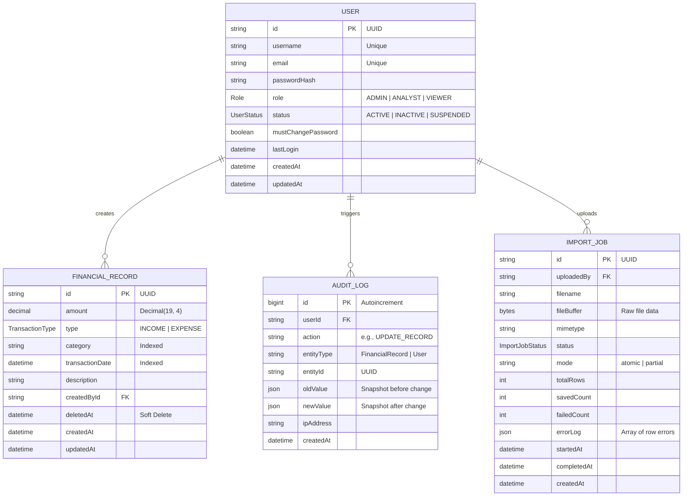

# FinTrack Database Schema Documentation

This document describes the database schema, data models, and interaction patterns for the FinTrack financial dashboard application. The system uses **MySQL** as the primary data store and **Prisma** as the ORM.

---

## 1. High-Level Architecture

The database is designed for auditability and analytical performance. Key architectural choices include:
- **Soft Deletes**: Financial records and users are never hard deleted to maintain referential integrity in the audit logs.
- **Denormalized Categories**: Categories are stored as plain strings on the financial records to avoid complex JOINs during dashboard aggregations.
- **Audit-First**: Every write operation (Create, Update, Delete) triggers an asynchronous audit log entry with full state snapshots.

---

## 2. Entity Relationship Diagram

---

## 3. Data Dictionary

### 3.1 Enums

| Enum | Value | Description |
| :--- | :--- | :--- |
| **Role** | `ADMIN` | Full system access, user management, and bulk imports. |
| | `ANALYST` | View all data, create/edit records. No user management. |
| | `VIEWER` | Read-only access to summaries and dashboards. |
| **UserStatus** | `ACTIVE` | Normal account state. |
| | `INACTIVE` | Deactivated by admin; cannot log in. |
| | `SUSPENDED` | Temporarily blocked due to security or policy. |
| **TransactionType** | `INCOME` | Positive money inflow. |
| | `EXPENSE` | Money outflow. Amounts are stored as positive; type provides context. |
| **ImportJobStatus** | `PENDING` | Created in DB, waiting for worker pickup. |
| | `PROCESSING` | Worker is currently parsing and saving rows. |
| | `COMPLETED` | All rows processed successfully. |
| | `PARTIAL` | Some rows failed validation (only in `partial` mode). |
| | `FAILED` | System error or `atomic` mode validation failure. |

### 3.2 Core Models

#### **User**
Manages identities, authentication, and access control.

| Field | Type | Description |
| :--- | :--- | :--- |
| **id** | `UUID` | Primary key. Unique identifier for the user. |
| **username** | `String` | Unique display name used for identification. |
| **email** | `String` | Unique email address; primary identifier for login. |
| **passwordHash** | `String` | BCrypt hashed password; never returned in API responses. |
| **role** | `Enum` | `ADMIN`, `ANALYST`, or `VIEWER`. Controls permission levels. |
| **status** | `Enum` | `ACTIVE`, `INACTIVE`, or `SUSPENDED`. Controls login ability. |
| **mustChangePassword** | `Boolean` | Forces a password reset on next login if set to `true`. |
| **lastLogin** | `DateTime?` | Timestamp of the user's most recent successful login. |

#### **FinancialRecord**
The core ledger storing all financial transactions.

| Field | Type | Description |
| :--- | :--- | :--- |
| **id** | `UUID` | Primary key. Unique identifier for the transaction. |
| **amount** | `Decimal(19,4)`| Precise transaction value; prevents rounding errors. |
| **type** | `Enum` | `INCOME` or `EXPENSE`. Defines the flow of money. |
| **category** | `String` | Free-form tag (e.g., "Salary", "Rent") used for grouping. |
| **transactionDate** | `DateTime` | The date the transaction actually occurred. |
| **description** | `String?` | Optional context or notes about the record. |
| **createdById** | `FK (User)` | Reference to the user who created the record. |
| **deletedAt** | `DateTime?` | Soft delete timestamp; `NULL` means the record is active. |

#### **AuditLog**
An immutable record of system changes for compliance and debugging.

| Field | Type | Description |
| :--- | :--- | :--- |
| **id** | `BigInt` | Primary key; autoincrementing long integer. |
| **userId** | `FK (User)?` | The user responsible for the change; nullable if user is deleted. |
| **action** | `String` | The type of change (e.g., `CREATE_RECORD`, `UPDATE_USER`). |
| **entityType** | `String` | The model being modified (`User` or `FinancialRecord`). |
| **entityId** | `String` | The UUID of the target entity. |
| **oldValue** | `Json?` | Database snapshot *before* the modification. |
| **newValue** | `Json?` | Database snapshot *after* the modification. |
| **ipAddress** | `String?` | The IP address of the user who performed the action. |

#### **ImportJob**
Tracks the state and results of bulk file uploads.

| Field | Type | Description |
| :--- | :--- | :--- |
| **id** | `UUID` | Primary key. Unique tracking ID for the import. |
| **uploadedBy** | `FK (User)` | The admin who uploaded the file. |
| **filename** | `String` | Original name of the uploaded file. |
| **fileBuffer** | `Bytes` | Temporary storage of raw file data for async processing. |
| **status** | `Enum` | Current state (`PENDING`, `PROCESSING`, `COMPLETED`, etc.). |
| **mode** | `String` | Import strategy (`atomic` or `partial`). |
| **totalRows** | `Int` | Number of records detected in the file. |
| **savedCount** | `Int` | Number of records successfully saved to the database. |
| **failedCount** | `Int` | Number of records that failed validation. |
| **errorLog** | `Json?` | Detailed log of row-level validation errors. |
| **completedAt** | `DateTime?` | Timestamp of when processing finished. |

---

## 4. Model Interactions

### A. Record Creation & Auditing
When a record is created via `RecordService`, two operations occur:
1. A new `FinancialRecord` is inserted with `createdById` linked to the current user.
2. An `AuditLog` entry is generated with `action: 'CREATE_RECORD'`, `newValue` containing the full record, and the user's `ipAddress`.

### B. Bulk Import Workflow
1. **User uploads file**: `ImportJob` is created with status `PENDING`.
2. **Queueing**: The job ID is pushed to the `importQueue`.
3. **Processing**: The background worker updates status to `PROCESSING`.
4. **Completion**: Worker saves successful records to `FinancialRecord`, creates `AuditLog` entries, and marks job as `COMPLETED` or `PARTIAL`.

### C. Access Control (RBAC)
Prisma is used alongside middleware to enforce security:
- `Role` is checked in the `authorize` middleware before reaching the controller.
- `UserStatus` is checked in the `authService` during login; only `ACTIVE` users can receive a JWT.
